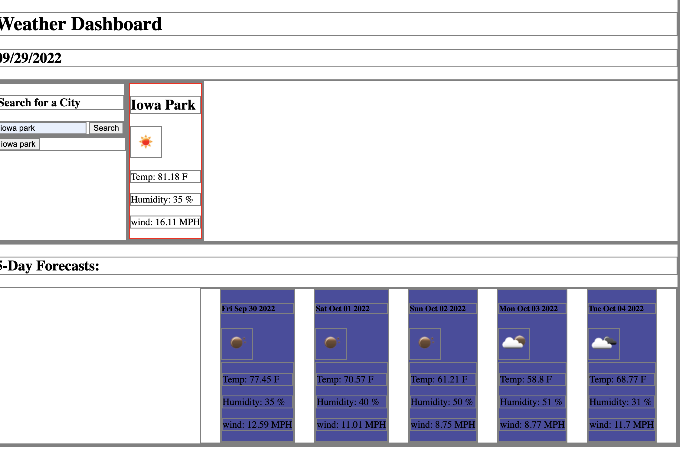

# weater-dashboard
 was tasked with making a weather dashboard so that i could plan trip based off of the cities weather. 

 

 ## Challenges

 I was struggling with this project for a while. I found that i dont really understand server side API as well as i need to in order to get this done. I had to get multiple tutoring sessions to get through this because im really struggling with this. 

 ## Goal

 Im going to make more time to dig deeper into learning how to get through javascript. 

 http://127.0.0.1:5501/index.html
 https://darbybiddy.github.io/weather-dashboard/
 